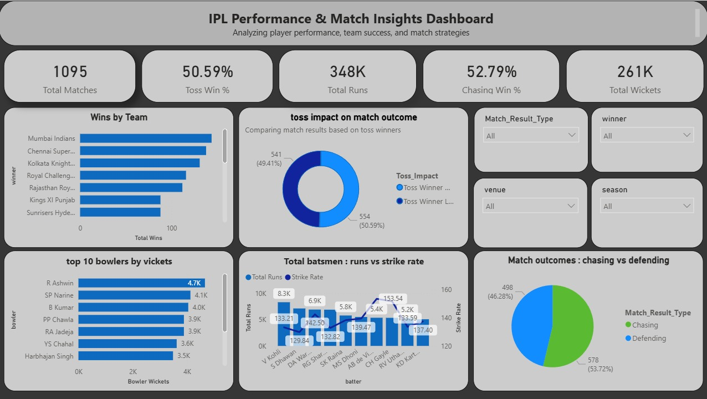

# IPL Performance Dashboard

## 📊 Project Overview
This project is a Power BI dashboard analyzing IPL team and player performance to identify trends and insights across matches.

## 🔧 Tools Used
- Power BI  
- Excel  

## 📈 Key Insights
- Identified top-performing teams based on wins and consistency  
- Analyzed match trends across seasons  
- Compared player performance metrics  

## 📷 Dashboard Preview

## 📌 Conclusion
This dashboard provides a clear understanding of team and player performance, helping in analyzing match outcomes and trends effectively.
